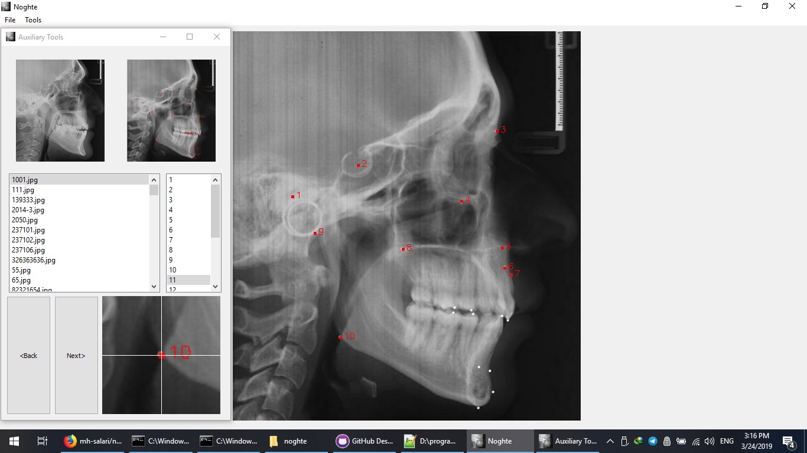

# noghte
Noghte is a simple GUI application that helps you to landmark your images 

## Screenshots:


## Install:
Install Pyhotn3 and pip3 then pull this repository, cd to 'noghte' and run the following command:

```sh
pip3 install -r requarments.txt
```
To start the program run this command:

```sh
python3 noghte.py
```

## How to Use
* From "File" Click "Open Folder" or "Open Image" to choose your dataset flder or  single image.
* Right click on the image to make landmark
* Click "Next>" or "<Back" to navigate between the images.

You can change the number and the name of landmarks by editing 'utils\landmark_name.txt' file

All the landmarks automatically stored in 'your provided folder(dataset)/landmarks', named as "IMAGENAME.pts"

